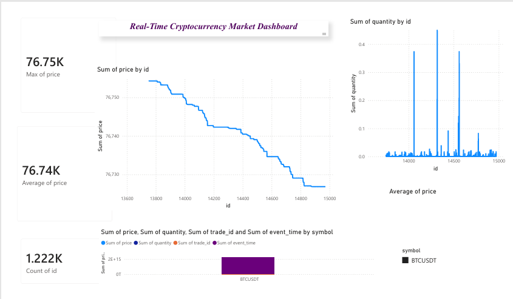

# 📈 Real-Time Cryptocurrency Analytics Pipeline

> A production-style streaming data pipeline that uses the Binance WebSocket API to ingest live BTC/USDT transaction events, maintains structured records in PostgreSQL, and displays market insights via an interactive Power BI dashboard.

---

## 🔍 What This Project Does

Most analytics projects work with static CSV files. This one doesn't.

This pipeline runs **continuously** — capturing every live trade event on the Binance exchange, processing the raw JSON stream in Python, persisting structured records into a relational database, and visualizing real-time market activity through a live dashboard.

It simulates a lightweight version of the real-time analytics workflows used in financial data platforms, trading systems, and streaming infrastructure teams.

## 🛠️ Tech Stack

| Layer | Technology | Purpose |
|---|---|---|
| Data Source | Binance WebSocket API | Live BTC/USDT trade stream |
| Streaming | Python (`websocket-client`) | Real-time WebSocket data ingestion |
| Database | PostgreSQL | Structured trade data storage |
| Database Driver | `psycopg2` | PostgreSQL connectivity and inserts |
| Analytics | SQL | Market analysis and trade insights |
| Visualization | Power BI | Interactive analytics dashboard |
| Containerization | Docker + Docker Compose | PostgreSQL container setup |
| Environment Management | `.env` + `python-dotenv` | Secure configuration management |

---


## ✨ Key Features

- **Real-time ingestion** — WebSocket consumer runs asynchronously, processing thousands of events per minute without blocking
- **Structured storage** — Raw JSON is validated, transformed, and inserted as typed records into PostgreSQL
- **SQL analytics layer** — Window functions compute OHLCV candles, VWAP, and rolling volume — no third-party analytics libraries needed
- **Power BI integration** — Dashboard connects to the live database and refreshes automatically
- **Dockerized database** — PostgreSQL runs in an isolated container with a named volume for persistent data across restarts
- **Clean separation of concerns** — Each layer (ingest → store → analyze → visualize) is independently testable and replaceable

---

## 📁 Project Structure

```text
cryptPro/
│
├── main.py
├── README.md
├── requirements.txt
├── docker-compose.yml
├── .gitignore
├── cryptoDash.pbix
├── dashboard_screenshots/
├── analytics.sql
└── .env
```

---

## ⚙️ Setup & Running

### 1. Clone the repo

```bash
git clone https://github.com/yourusername/crypto-pipeline.git
cd crypto-pipeline
```

### 2. Configure environment variables

```bash
cp .env.example .env
# Fill in your credentials — Docker Compose will read these automatically
```

```env
DB_HOST=localhost
DB_PORT=5432
DB_NAME=crypto_db
DB_USER=your_user
DB_PASSWORD=your_password
```

### 3. Start PostgreSQL with Docker

```bash
docker compose up -d
```

This spins up a PostgreSQL 16 container (`crypto-postgres`) in the background, with credentials sourced from your `.env` file and data persisted in a named Docker volume (`postgres_data`).

Verify it's running:

```bash
docker ps
# CONTAINER ID   IMAGE         STATUS        PORTS                    NAMES
# xxxxxxxxxxxx   postgres:16   Up X seconds  0.0.0.0:5432->5432/tcp   crypto-postgres
```

The `docker-compose.yml`:

```yaml
version: "3.9"

services:
  postgres:
    image: postgres:16
    container_name: crypto-postgres
    restart: always
    env_file:
      - .env
    environment:
      POSTGRES_USER: ${DB_USER}
      POSTGRES_PASSWORD: ${DB_PASSWORD}
      POSTGRES_DB: ${DB_NAME}
    ports:
      - "${DB_PORT}:5432"
    volumes:
      - postgres_data:/var/lib/postgresql/data

volumes:
  postgres_data:
```

### 4. Install dependencies

```bash
pip install -r requirements.txt
```

### 5. Initialize the database schema

```bash
psql -h localhost -U your_user -d crypto_db -f database/schema.sql
```

### 6. Start the streaming pipeline

```bash
py main.py
```

The consumer will immediately begin ingesting live BTC/USDT trades and writing them to PostgreSQL.

### 7. Open Power BI

Open `cryptoDash.pbix`, update the PostgreSQL connection string to point to your local database, and hit refresh.

---

## 📊 Dashboard Preview



The Power BI dashboard provides:

- Real-time BTC price tracking
- Trade activity visualization
- Market KPI monitoring
- Trading volume analysis
- Live cryptocurrency trend insights


## 📊 Sample SQL Analytics

### Average BTC Price

```sql
SELECT AVG(price)
FROM trades;
```

### Maximum BTC Price

```sql
SELECT MAX(price)
FROM trades;
```

### Total Trades Processed

```sql
SELECT COUNT(*)
FROM trades;
```

### Recent Trades

```sql
SELECT *
FROM trades
ORDER BY id DESC
LIMIT 10;
```
---

## 📌 What I Learned

- Designing PostgreSQL schemas optimized for time-series ingestion and range queries
- Writing analytical SQL using window functions and CTEs without relying on pandas
- Containerizing a stateful database service with Docker Compose and managing persistent volumes
- Structuring a multi-layer data pipeline with clean separation between ingestion, storage, and presentation

---

## 🚀 Potential Enhancements

- [ ] Add Apache Kafka as a message broker between the WebSocket consumer and PostgreSQL
- [ ] Add anomaly detection on price/volume spikes using a rolling Z-score
- [ ] Expand to multiple trading pairs (ETH/USDT, BNB/USDT)
- [ ] Replace Power BI with a Grafana dashboard for a fully open-source stack

---

## 📜 License

MIT License — feel free to use, fork, and build on this project.

---

> Built to demonstrate real-time data engineering skills using live financial market data.